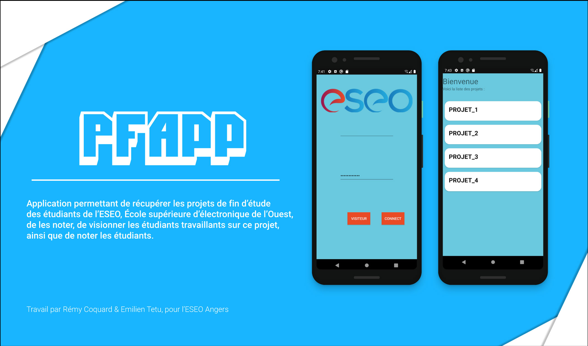

# PFApp


[](https://github.com/RemyCo/PFApp/blob/master/LICENSE)




App developped for an ESEO Android Project. Will be used on open days by the school. Application that can get the Final practicum of students in ESEO, Engineering school in Angers. This application can also mark projects, can see students on projects, and can mark the students.

## How to import the project ?

### In Android studio :

1. Open Android Studio

2. Click on Check out project from Version Control

3. Click on Git

4. On URL, put https://github.com/RemyCo/PFApp

### In files :

```bash
# Clone this repository
$ git clone https://github.com/RemyCo/PFApp.git
```
